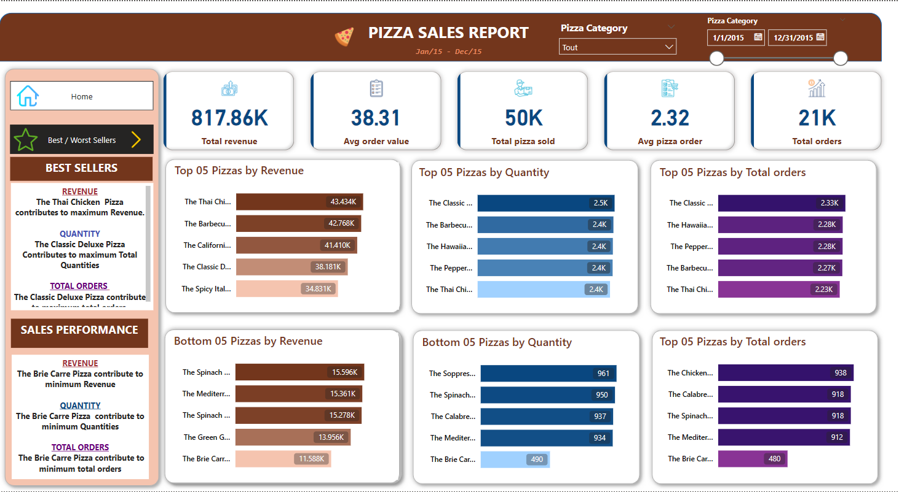

# Project Overview: Pizza Sales Management
**Project Description**
The Pizza Sales Management project aims to analyze and manage sales data for a pizza business. The goal is to derive insights from sales trends, customer preferences, and operational performance. The project involves collecting, transforming, and visualizing data to support decision-making and improve business outcomes.
# Problem STATEMENT

**KPI's  REQUIREMENT**
We need to analyze key indicators for our pizza sales data to gain insights into our business performance. Specifically, we want to calculate the following metrics : 

* 1. Total revenue: The sum of the total price of all pizza orders.

* 2. Average order value: Thee average amount spent per order, calculated by dividing the total revenue by total number or orders.

* 3. Total pizzas sold: The sum of the quantities of all pizza sold.

* 4. Total Orders: The total number of orders placed.

* 5. Average Pizzas Per Order: The average number of pizzas sold per order, calculated by dividing the total number of pizzas sold by the total number of orders.

**CHARTS REQUIREMENT**
We would like to visualize various aspect of our pizza sales data to gain insights and understand key trends. We have identified the following requirements for creating charts:

* 1. Daily trend for total orders:
Create a bar chart that displays the daily trend of total orders over a specific time period. This chart will help us identify any patterns or flutuations in order volumes on a daily basis.

* 2. Monthly trend for total orders:
Create a line chart that illustrates the hourly trend of total orders throughout the day. This chart will allow us to identify peak hours or periods of high order activity.

* 3. Percentage of sales by pizza category:
Create a pie chart that shows the distribution of sales across different pizza categories. This chart will provide insights into the popularity of various pizza categories and their contribution to overall sales.

* 4. Percentage of sales bu pizza size:
Generate a pie chart that represents the percentage of sales attributed to different pizza sizes. This chart will help us to understand customer preferences for pizza sizes and their impact on sales.

* 5. Total pizzas sold by pizza category: Create a funnel chart that presents the total number of pizzas sold for each pizza category. This chart will allow us to compare the sales performance of different pizza categories.

* 6. Top 5 best sellers by revenue, total quantity and total orders.
Create a bar chart highlighting the top 5 best-selling pizzas based on the revenue, total quantity, total orders. This chart will help us identify the most popular pizza options.

* 7. Bottom 5 best sellers by revenue, total quantity and total orders
Create a bar chart showcasing the bottom 5 worst-selling pizzas based on the revenue, total quantity, total orders. This chart will enable us to identify underperforming or less popular pizza options 

# SOFTWARE USED

* MS OFFICE/ EXCEL
* MS SQL SERVER 
* SQL SERVER MANAGEMENT STUDIO
* POWER BI

# SCREENSHOTS

**HOME**

**BEST / WORST SELLERS**

# DEMO
[DASHBOARD PAGE](pizza-management-sales-2024-09-04-08-32-47_AonavO5a.mp4)